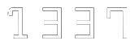

# Hackathon-AI-2023
Firstly, we want to Thank think AI Morocco 2023 for the 3-days AI hackathon co-hosted by 1337AI and Math&amp;Maroc.
<table>
  <tr>
    <td>****thinkai
</td>
    <td>*****1337
</td>
  </tr>
</table>
Welcome to our AI-powered generative interior design project, where we explore the beauty of Moroccan culture through innovative AI techniques!
As a demonstration we put in 3 images from dormitories of UM6P in our code to generate add a moroccan touch.
***************3images

Our AI-powered generative interior design is an exciting fusion of traditional Moroccan aesthetics and modern technological innovation. By leveraging the power of AI, we are able to create designs that seamlessly integrate intricate Moroccan patterns, vibrant colors, and luxurious textures, all while maintaining a strong focus on functionality and practicality.

Our project consists of three main processes: data scraping, preprocessing, and diffusion 1.5. Using techniques such as data cleaning and normalization. Finally, we utilize the cutting-edge diffusion 1.5 algorithm to generate stunning, culturally-inspired interior designs.


1- Scraping
Scraping 50 images from each Query 
```python
Query =  ['Moroccan room design ideas',
    'Moroccan bedroom design ideas',
    'Living room decor ideas with Moroccan touch',
    'Moroccan style bathroom ideas',
    'How to decorate a room in Moroccan style',
    'Moroccan inspired living room ideas',
    'Moroccan decor ideas for small spaces',
    'Moroccan style furniture ideas',
    'Moroccan interior design tips',
    'Moroccan color scheme ideas for rooms',
    'DIY Moroccan room decor ideas',
    'Moroccan lighting ideas for rooms',
    'How to create a Moroccan-inspired outdoor space',
    'Moroccan rugs for rooms',
    'Moroccan style curtains and drapes',
    'Moroccan zellige tile design ideas', 
    'Beni Ourain rug decor ideas', 
    'Moroccan leather pouf design ideas', 
    'Moroccan brass lanterns for decor', 
    'Moroccan ceramic bowl decor ideas', 
    'Moroccan wood carving design ideas', 
    'Moroccan textile patterns for decor', 
    'Moroccan wrought iron furniture design ideas']
 ```   
 In total we will have 23 Query x approx~45 that will make it 1035 images with its corresponding img {count}.txt file that will have the title of each image, and we will seperate the two into two files Bs4_Images and captions.
 
 2- Preprocessing 
 Removing punctuations and numbers for captions also resizing images to a more standard size 512*512 for a better model.
 
 
 
 
 
 
 
 
 
 
 
 
 
 
 
 
 
 
 
